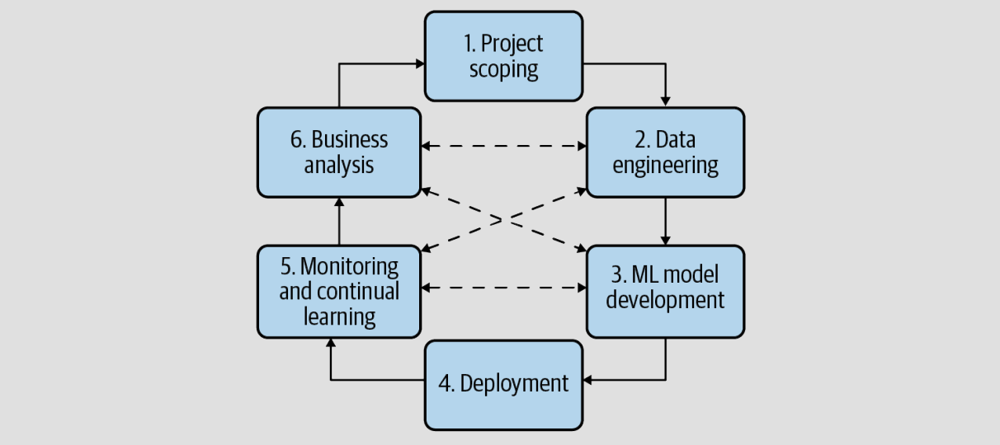

# Summary of the first three chapters of "Designing Machine Learning Systems" by Chip Huyen

## Chapter 1: Overview of Machine Learning Systems

In the opening chapter, Chip Huyen delves into the business requisites for Machine Learning (ML) systems, centering on the crucial aspects of **When to Use Machine Learning** and **What Constitutes Machine Learning Systems**.

### When to Use Machine Learning

The author sheds light on appropriate contexts for employing ML, introducing nine essential concepts that underline the operational framework of ML:

* **1. Learn:** An ML system's learning capability hinges on its access to data. Generally, these systems acquire knowledge from data;

* **2. Complex Patterns:** For ML to be effective, it must decipher complex patterns. Without discernible patterns, ML solutions falter. Conversely, if the pattern is straightforward, simpler algorithms might offer a more efficient resolution. This concept is vividly captured in Figure 1-2, illustrating the dichotomy between Traditional Systems and Machine Learning;

  

* **3. Existing data:** ML models require data to learn. The absence of data necessitates its collection or scraping.

* **4. Predictions:** ML thrives on predictive challenges. These models are designed to forecast, thus are apt for issues necessitating predictive solutions.

* **5. Unseen data:** The efficacy of an ML model's learned patterns from existing data extends to its application on unseen data, provided these patterns persist.

* **6. It’s repetitive**: While humans are adept at learning from minimal instances, ML algorithms typically need a multitude of examples, with repetition enhancing their learning capability.

* **7. The cost of wrong predictions is cheap:** ML models are particularly advantageous in scenarios where inaccuracies incur minimal consequences, such as in recommendation systems. Nevertheless, they find application in high-risk areas like autonomous vehicles, where the overall benefits justify the potential risks.

* **8. It's at scale:** Given the substantial initial investment in data, computing power, infrastructure, and expertise required, ML solutions are particularly suited for large-scale operations that demand regular predictions, benefiting from ongoing data collection.

* **9. The patterns are constantly changing:** The ephemeral nature of cultural, taste, and technological trends underscores the agility of ML systems. Unlike static solutions, ML can adapt to evolving patterns by assimilating updated data, thereby offering sustained relevance.

Since the mid-2010s, machine learning (ML) has transformed both consumer and enterprise applications, offering enhanced or novel services. It's become indispensable for navigating the vast information and services online, powering search engines and recommendation systems on platforms like Amazon and Netflix. ML aids daily activities through predictive typing, photo editing suggestions, and secure authentication using fingerprints or facial recognition. Personal stories highlight ML's role in breaking language barriers and monitoring health at home. Despite the surge in consumer ML applications, the enterprise sector remains the primary user, with distinct requirements for accuracy and latency. Enterprises leverage ML for both internal efficiencies and external customer engagement, illustrating its versatility and impact across various applications. This concept is depicted in Figure 1-3 from the book, showcased below:

  

### What Constitutes Machine Learning Systems

The main idea here is to understand the differences between ML in research and production environments. To accomplish this, Huyen selected 5 keys placed in the table from figure bellow.

  

#### Requirements

Initially, it's crucial to acknowledge the varied needs of different stakeholders within production environments, as different to research settings where the focus primarily lies on achieving state-of-the-art model performance on benchmark datasets. Research and leaderboard initiatives typically drive participants towards optimizing model performance, which can lead to unnecessarily complex models. However, the deployment of an ML system in a real-world scenario entails navigating the diverse and sometimes conflicting requirements of various stakeholders, making the process of model selection more challenging. This complexity is exemplified in a case study involving a restaurant recommendation app, which reveals the disparate priorities of ML engineers, sales teams, product teams, and management. These range from enhancing model accuracy and system efficiency to maximizing revenue, illustrating the intricate balance needed to meet the collective objectives.

#### Computational priorities

Then, we have to consider Computational priorities. Designing ML systems often leads to an overemphasis on model development, overlooking deployment and maintenance. Initially, training dominates as the bottleneck due to multiple data passes, but post-deployment, inference becomes the challenge, shifting the focus from training speed to inference speed. This shift changes priorities from high throughput in research to low latency in production, impacting user experience and conversion rates significantly. For instance, even a small delay can substantially decrease conversions, highlighting the critical nature of latency. In production, reducing latency might mean underutilizing hardware, but it's crucial for maintaining user engagement. Latency distribution, rather than average latency, provides a more accurate system performance measure, emphasizing the importance of considering high percentile latencies to identify outliers and ensure system reliability for all users, especially the most valuable ones.

#### Data

On the third consideration, attention turns to the data aspect. In research, datasets are typically clean, well-structured, and static, allowing for focused model development and benchmarking. These datasets often come with community insights and ready-to-use processing scripts. In contrast, production data is messy, noisy, potentially unstructured, and continuously evolving. It may contain biases, sparse or incorrect labels, and necessitates updates due to shifting requirements. Privacy and regulatory concerns are paramount when dealing with user data. Unlike the static historical data in research, production environments frequently require handling real-time data generation from various sources, highlighting the stark contrast in data challenges between research and real-world applications.

#### Fairness

When addressing fairness, it's noteworthy that during the research phase, considerations of fairness are often postponed until the model reaches production—a stage at which rectifying biases becomes significantly challenging. The pursuit of enhancing model accuracy or reducing latency often overlooks the critical aspect of fairness, a domain yet to establish a benchmark for "best practices." Unwittingly, many individuals face adverse effects from biased ML algorithms, affecting crucial life aspects like loan applications, employment opportunities, and financial terms, which are influenced by socio-economic factors or personal attributes. Instances of such biases manifest in discriminatory lending and law enforcement practices. Despite a 2019 study revealing that only a minority of companies proactively combat algorithmic biases, there's a growing recognition of the importance of integrating fairness into AI systems, underscoring the imperative for commitment to responsible AI practices.

#### Interpretability

The significance of interpretability in machine learning systems came to the forefront in early 2020 when Geoffrey Hinton, a Turing Award laureate, ignited a debate with a provocative scenario comparing a more effective AI surgeon to a less effective human counterpart. This comparison elicited divided responses from technology executives, underscoring a prevalent apprehension towards AI systems that lack explainability, especially in vital decision-making contexts. Although ML research has traditionally prioritized model performance, there's a growing realization within the industry of the critical need for interpretability to build trust, identify biases, and facilitate model refinement. Despite this acknowledgment, as of 2019, a limited number of companies were actively pursuing efforts to improve the explainability of their algorithms.

## Chapter 2: Introduction to Machine Learning Systems Design

Chapter 2 of "Designing Machine Learning Patterns" dives into the practical aspects of designing an ML system with a holistic approach, emphasizing the integration of business requirements, data, infrastructure, deployment, and monitoring. The chapter begins by stressing the importance of defining clear objectives, driven by business needs that should be translated into ML objectives to steer model development. It introduces four essential requirements for system development: reliability, scalability, maintainability, and adaptability, proposing an iterative design process to meet these criteria. Before delving into ML algorithms, the author advises on framing the problem in a manner that ML can effectively solve, highlighting the significant impact of problem framing on the difficulty of the task. Additionally, the chapter discusses the crucial role of data in ML systems and engages with the ongoing debate in ML literature regarding the relative importance of data versus intelligent algorithms.

### Business and ML Objectives

In this segment, the focus is on aligning ML projects with business objectives rather than solely improving ML metrics like accuracy or F1 score. The narrative stresses that companies prioritize business metrics over ML enhancements, pointing out that many ML projects fail because they don't visibly contribute to business goals such as profit maximization, sales increase, cost reduction, or customer satisfaction. For ML initiatives to be successful, their outcomes must demonstrably impact relevant business metrics, whether directly influencing revenue or indirectly through customer engagement metrics. The text also explores how certain ML applications, such as ad click-through rate prediction and fraud detection, naturally align with business objectives due to their direct impact on revenue and cost-saving. Moreover, it highlights the challenge of quantifying the effect of ML on business metrics and the necessity for experiments, like A/B testing, to empirically determine this impact. The discussion underscores the long-term nature of ML benefits, illustrated by Google’s gradual advancements over decades, and notes the increased efficiency and returns on ML investment with maturity in its application.

### Requirements for ML Systems

Successfully building an ML system requires fulfilling specific requirements that differ by use case but generally include four key characteristics: reliability, scalability, maintainability, and adaptability. Each of these essential attributes can be succinctly described as follows:

* **Reliability:** Ensures the system performs correctly even amidst challenges like hardware/software faults or human errors. Determining "correctness" in ML systems can be complex, as the system may operate without evident errors even when outputs are incorrect. Unlike traditional systems that may show explicit errors (e.g., crashes or 404 errors), ML systems can fail silently, leaving users unaware of any issues. For instance, inaccuracies in Google Translate may not be immediately obvious to users unfamiliar with the target language.

* **Scalability:** An ML system may expand in various ways, including complexity, traffic volume, and model count. A system might evolve from using simple models within minimal resource requirements to complex neural networks demanding significant memory. Additionally, the system's daily prediction requests could surge from thousands to millions as the user base expands. The number of models may also grow to cater to different features or customer-specific needs, as seen in startups scaling up to thousands of models for enterprise clients. Effective scalability involves both up-scaling and down-scaling resources as needed, utilizing features like autoscaling to adjust to usage dynamically. This process requires collaboration among diverse team members, including ML engineers, DevOps, and SMEs, ensuring they can work with their preferred tools and methodologies. Documentation, versioning, and reproducibility are critical to facilitate teamwork and problem-solving, emphasizing the need for a well-structured team approach detailed in the section "Team Structure."

* **Adaptability:** This attribute emphasizes the ML system's ability to adjust to changes in data distributions and business requirements efficiently, ensuring continuous performance improvement and the capability for updates without disrupting services. Given that ML systems combine code and data, and data landscapes can rapidly evolve, adaptability is crucial. This characteristic is closely related to maintainability. The book further explores the topics of adapting to changing data distributions and the ongoing updating of models with new data in dedicated sections on "Data Distribution Shifts" and "Continual Learning."

### Interactive Process

Developing an ML system is an iterative and ongoing journey rather than a one-time, linear progression. Initially, we envisioned the process as straightforward: collect data, train a model, deploy it, and then conclude the project. However, we quickly discovered that **it more closely resembles a cycle**, requiring frequent revisits and refinements to various stages. For instance, in our experience of building an ML model for predicting ad visibility based on search queries, we navigated through several iterations. These included selecting optimization metrics, collecting and labeling data, engineering features, and repeatedly training the model to address challenges such as incorrect labels, biased data distribution, and model staleness. Each step brought new insights, leading to adjustments like relabeling data, acquiring more balanced datasets, and updating the model with recent data. Additionally, shifting business goals necessitated model reevaluation to focus on different performance metrics, such as optimizing for ad click-through rates instead of just impressions. This iterative workflow underscores the complexity and evolving nature of ML system development, emphasizing that each phase, from initial model training to final deployment, is part of a larger, cyclical process that may circle back for enhancements and updates.

  

### Framing ML Problems

In Chapter 2 of "Designing Machine Learning Systems," Chip Huyen tackles the crucial step of "Framing ML Problems", guiding us through the process of translating real-world challenges into problems that machine learning (ML) can effectively solve. The author says that not every issue presented in a business context is immediately recognizable as an ML problem. The key lies in identifying the problem's inputs, outputs, and the objective function, which are essential for guiding the learning process.

Through an illustrative scenario where you are an ML engineering tech lead at a bank, Huyen demonstrates how to approach a task from your boss to expedite customer service support using ML — a request sparked by a competitor's success. This scenario emphasized that the essence of ML problem framing involves dissecting a broad challenge (in this case, slow customer support) to discover its ML-compatible components.

The bottleneck was pointed to be the routing of customer requests to the correct department. By redefining this issue as a classification problem, where the input is the customer request and the output is the department it should be routed to, it becomes clear how ML can be applied. The objective function would then minimize the mismatch between the model's department predictions and their actual destinations.

This chapter insightfully underscores the importance of not just accepting tasks at face value but critically assessing and framing them to fit within ML's capabilities. It sets the stage for further exploration into feature extraction and defining objective functions, promising to equip readers with the foundational skills to transform vague requests into tangible, solvable ML problems.

## Chapter 3: Data Engineering Fundamentals

### Data Sources

This chapter outlines six key points crucial for implementing an effective ML system. First of all is understand the **Data Sources**. Understanding where data originates is essential for efficient usage and processing. User input data, one of the sources, includes text, images, videos, and files, often requiring rigorous validation due to its prone nature to errors and malformation. Another vital source is system-generated data, such as logs and model predictions, which, despite its usefulness, can overwhelm with volume, making tools like Logstash and Datadog necessary for management. Additionally, internal databases within a company provide essential data for ML models, assisting in processes like search intention detection and product availability checks.

### Data Formats

The second key point focuses on **Data Formats**. While there are numerous data formats, the most commonly encountered ones are highlighted below. It's important to note that there is no "one-size-fits-all" format; instead, each format excels in specific scenarios and is chosen based on the task at hand.

  

#### JSON

JSON is a widely used, language-independent format that's human-readable and supports various data structures through key-value pairs. Despite its ubiquity and versatility, JSON poses challenges, especially when modifying an established schema, leading to potential difficulties in data management. As text files, JSON files can also consume significant storage space.

#### Row-Major Versus Column-Major Format

CSV and Parquet represent two distinct data storage paradigms: row-major and column-major, respectively. CSV, being row-major, stores consecutive elements of a row together, making row access efficient—ideal for accessing entire examples in machine learning datasets. Conversely, Parquet's column-major approach stores column elements together, facilitating efficient access to specific features within large datasets. While row-major formats excel in scenarios requiring frequent data writes, column-major formats are superior for tasks involving selective reading of columns, offering flexibility and performance benefits depending on the operation type.

#### Text Versus Binary Format

CSV and JSON are text formats, making them human-readable but less space-efficient than binary formats like Parquet. Binary files, which consist of 0s and 1s, require specific programs for interpretation. While text files are easily readable in text editors, binary files appear as incomprehensible blocks of numbers. Binary formats offer compact storage solutions; for example, storing a large number in binary format consumes significantly less space than in text format. Converting a CSV file to Parquet halved its size, highlighting binary files' efficiency in storage and Amazon AWS's recommendation of Parquet for its speed and reduced storage consumption on S3.

### Data Models

The second key point focuses on **Data Models**. Data models define data representation, like a car's make, model, year, color, and price, or its owner, license plate, and address history. The choice of representation influences system design and problem-solving capabilities, benefiting different users like buyers or police. This section explores relational and NoSQL models, illustrating their suitability for several problems despite their apparent differences.

#### Relational Database

The relational model, developed by Edgar F. Codd in 1970, remains a foundational and increasingly popular concept in computer science, structuring data into relations or sets of tuples, visualized as tables. These relations are characterized by their unordered nature, supporting flexibility in data management and typically stored in formats like CSV or Parquet. Relational databases employ SQL for data retrieval, a query language that has evolved from Codd's original model but still serves as the predominant method for interacting with databases. SQL is notable for its declarative approach, allowing users to specify what data they need without dictating the retrieval process, a task left to the database's query optimizer. Despite SQL's potential for broad computational applications, real-world usage can be hampered by complex query construction and execution challenges, underscoring the critical role of query optimizers and the potential for machine learning to refine this process.

#### NoSQL

The relational data model, while broadly applicable from e-commerce to social networks, faces limitations due to its rigid schema requirements, leading to significant challenges in schema management and SQL query execution for specialized applications. This frustration spurred the adoption of nonrelational databases, notably through the NoSQL movement, which has evolved to encompass both traditional and nonrelational approaches. NoSQL databases, including document and graph models, cater to specific needs—document models for self-contained data with few inter-document relationships and graph models for data where relationships are crucial. This shift represents a broadening of database technology to meet diverse data handling needs.

#### Structured Versus Unstructured Data

Structured data adheres to a predefined schema, facilitating analysis but requiring commitment to a specific structure that can become restrictive with changing business needs or schema updates, potentially leading to data inconsistencies. For instance, introducing new data fields retrospectively can introduce bugs, like incorrectly assigning ages in a database. Conversely, unstructured data lacks a fixed schema, offering flexibility in storage and adaptability to varied data types such as text, images, and logs. While unstructured data can contain patterns enabling structure extraction, it doesn't enforce a uniform format. Data lakes typically store unstructured raw data, while data warehouses hold processed, schema-conforming data. This distinction highlights the trade-offs between the structured organization for easy analysis and the flexibility of unstructured data to accommodate diverse and evolving information needs. The table bellow show the key differences between structured and unstructured data.
 

  

### Data Storage Engines and Processing

Data formats and models outline how data is stored and accessed, while storage engines or databases implement these specifications. Understanding various database types is crucial as they are optimized for either transactional or analytical processing, differing significantly in function. This knowledge is essential for selecting the right database for specific applications. Additionally, the chapter introduces the ETL (extract, transform, load) process, a fundamental component in developing production-level ML systems.

#### Transactional and Analytical Processing

Transactional data processing, or online transaction processing (OLTP), involves actions like tweeting or ordering a ride, requiring low latency and high availability to avoid user delays. Transactional databases, designed for OLTP, typically prioritize ACID principles—atomicity, consistency, isolation, durability—to ensure reliable and secure transactions. However, ACID's strictness leads some developers towards BASE (Basically Available, Soft state, Eventual consistency) for more flexibility. Traditionally, transactional databases (row-major) weren't suited for analytical queries, which led to the development of analytical databases (OLAP) for data aggregation and analysis. Recent advancements blur OLTP and OLAP distinctions, with modern databases handling both types of queries efficiently, challenging the need for separate transactional and analytical systems and introducing flexible data storage and processing paradigms.

#### ETL: Extract, Transform, and Load

The ETL (Extract, Transform, Load) process, foundational in data management and increasingly relevant in ML applications, involves extracting data from various sources, transforming it into a desired format, and loading it into a destination like a database or data warehouse. This process ensures data validation, cleansing, and standardization, facilitating efficient data integration and preparation. However, the advent of the internet and advancements in hardware have led to an explosion in data volume and diversity, prompting some organizations to adopt the ELT (Extract, Load, Transform) model, prioritizing raw data storage in data lakes for later processing. This shift aims to accommodate rapid data accumulation and evolving data schemas, although searching through vast amounts of unstructured data for specific information can become cumbersome. As cloud computing and standardized infrastructures emerge, committing to predefined schemas has become more viable, leading to the development of "data lakehouse" solutions by vendors like Databricks and Snowflake, which merge the flexibility of data lakes with the structured approach of data warehouses, offering a hybrid model that addresses the challenges of managing and processing large and diverse data sets.

